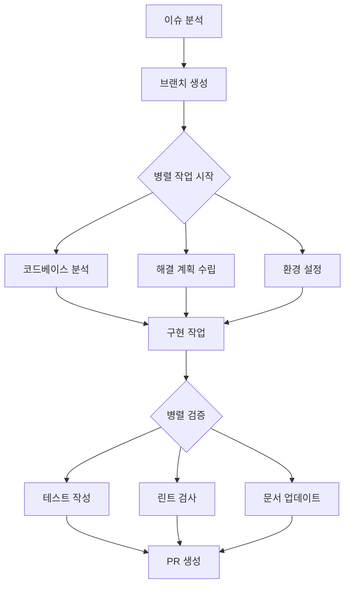

# 개발 방법론 및 작업 프로세스 (통합본)

⚠️ **레거시 프로젝트 방법론 - 참고용**

---

## 📋 문서 개요

이 문서는 효율적인 개발을 위한 작업 방법론과 프로세스를 정리한 통합 가이드입니다.

- **목적**: 체계적인 이슈 분해 및 해결 프로세스 제공
- **대상**: 개발팀, PM, 에이전트 시스템
- **활용**: 프로젝트 작업 계획 및 실행 시 참고

---

## 🔧 Part 1: 이슈 분해 및 작업 세분화 방법론

### 1. 전체 작업 목표 정의
작업을 시작하기 전 명확한 목표를 설정합니다.

```markdown
## 작업 목표 정의 템플릿
- **목적**: 무엇을 만들 것인가?
- **주요 내용**: 어떤 기능/내용이 포함되는가?
- **기대 결과**: 완료 후 어떤 상태가 되어야 하는가?
- **성공 기준**: 어떻게 완료를 판단할 것인가?
```

### 2. 기존 자료 분석
관련 문서와 코드를 분석하여 패턴과 구조를 파악합니다.

```markdown
## 분석 체크리스트
- [ ] 관련 MD 파일 검토 (PRD.md, USER_MEMORY.md 등)
- [ ] 공통 구조 및 목차 패턴 파악
- [ ] 형식 및 스타일 가이드 확인
- [ ] 반복되는 패턴 및 템플릿 식별
- [ ] 기존 코드 구조 및 아키텍처 이해
```

### 3. 이슈 세분화 및 고유 번호 부여
전체 작업을 관리 가능한 단위로 분해합니다.

```markdown
## 이슈 분해 원칙
1. **단일 책임**: 각 이슈는 하나의 명확한 목적을 가짐
2. **독립성**: 다른 이슈와 최소한의 의존성
3. **추정 가능**: 시간과 복잡도를 예측할 수 있는 크기
4. **검증 가능**: 완료 여부를 명확히 판단 가능

## 고유 번호 체계
- ISSUE-001, ISSUE-002, ... (순차적 번호)
- FEAT-001, BUG-001, DOC-001 (타입별 분류)
- AUTH-001, QNA-001, UI-001 (기능별 분류)
```

### 4. 우선순위 기반 Todo 리스트 작성
이슈별로 우선순위를 분석하여 실행 순서를 결정합니다.

```markdown
## 우선순위 기준
- **P0 (Critical)**: 프로젝트 성공에 필수적
- **P1 (High)**: 핵심 기능, 빠른 처리 필요
- **P2 (Medium)**: 중요하지만 연기 가능
- **P3 (Low)**: 부가 기능, 시간 여유시 처리

## Todo 항목 포맷
[이슈번호][우선순위] 작업내용 (담당자/에이전트)
예: [ISSUE-001][P1] 사용자 인증 API 구현 (Backend)
```

### 5. 작업 순서 및 의존성 설계
이슈 간의 의존관계를 분석하여 최적의 실행 순서를 결정합니다.

```markdown
## 의존성 분석 방법
1. **선행 조건**: 이 작업을 시작하기 위해 완료되어야 할 작업
2. **병렬 처리**: 동시에 진행 가능한 작업 그룹
3. **후속 작업**: 이 작업 완료 후 시작 가능한 작업
4. **블로킹**: 다른 작업을 막는 중요한 작업

## 시각화 예시
1 → 2 → 3 → 4 (순차 실행)
1 ⇒ [2, 3] → 4 (병렬 후 통합)
```

---

## ⚡ Part 2: GitHub 이슈 해결 자동화 프로세스

### 커스텀 슬래시 커맨드 구조
GitHub 이슈를 체계적으로 해결하기 위한 자동화된 워크플로우입니다.

```bash
# 커맨드 형식
/resolve-issue <이슈번호>

# 실행 예시
/resolve-issue 42
```

### 8단계 해결 프로세스

#### 1단계: 이슈 불러오기
```markdown
## 이슈 분석 체크리스트
- [ ] 이슈 제목과 설명 확인
- [ ] 요구사항 및 수용 기준 파악
- [ ] 관련 라벨 및 우선순위 확인
- [ ] 연관된 이슈 및 PR 검토
- [ ] 담당자 및 마일스톤 확인
```

#### 2단계: 브랜치 세팅
```bash
# 브랜치 명명 규칙
git checkout -b issue-{번호}-{간단한설명}

# 예시
git checkout -b issue-42-social-login
git checkout -b issue-43-ai-classification
```

#### 3단계: 코드베이스 분석 (병렬 수행)
```markdown
## 분석 대상
- [ ] 영향을 받는 파일 및 함수 식별
- [ ] 관련 의존성 및 모듈 확인
- [ ] 기존 테스트 코드 검토
- [ ] 성능 및 보안 영향 분석
- [ ] 호환성 및 브레이킹 체인지 검토
```

#### 4단계: 이슈 해결 계획 수립
```markdown
## 계획 수립 템플릿
### 작업 분해
1. [작업1] 예상시간: 2h
2. [작업2] 예상시간: 3h
3. [작업3] 예상시간: 1h

### 리스크 식별
- **기술적 리스크**: API 변경, 호환성 문제
- **일정 리스크**: 의존성 지연, 예상보다 복잡
- **품질 리스크**: 테스트 부족, 문서화 누락

### 완료 기준
- [ ] 기능 구현 완료
- [ ] 테스트 통과
- [ ] 코드 리뷰 승인
- [ ] 문서 업데이트
```

#### 5단계: 이슈 해결 (병렬 가능시 분할)
```markdown
## 구현 원칙
1. **작은 커밋**: 논리적 단위로 자주 커밋
2. **명확한 메시지**: 변경 사항을 명확히 기술
3. **코딩 표준**: 프로젝트 스타일 가이드 준수
4. **주석 및 문서**: 복잡한 로직에 충분한 설명

## 커밋 메시지 규칙
feat: 새로운 기능 추가
fix: 버그 수정
docs: 문서 수정
style: 코드 스타일 변경
refactor: 코드 리팩토링
test: 테스트 코드 추가/수정
```

#### 6단계: 테스트 작성
```markdown
## 테스트 전략
### Unit Tests
- [ ] 새로 추가된 함수/메서드
- [ ] 수정된 기존 함수
- [ ] Edge cases 및 예외 상황

### Integration Tests
- [ ] API 엔드포인트
- [ ] 데이터베이스 연동
- [ ] 외부 서비스 연동

### E2E Tests
- [ ] 주요 사용자 플로우
- [ ] 크리티컬 패스
```

#### 7단계: 린트 및 검증
```bash
# 자동화된 검증 파이프라인
npm run lint        # ESLint 실행
npm run type-check  # TypeScript 검증
npm run test        # 테스트 실행
npm run build       # 빌드 확인
```

#### 8단계: 풀 리퀘스트 생성
```markdown
## PR 템플릿
### 변경 사항 요약
- 무엇을 변경했는지 간단히 설명

### 관련 이슈
- Closes #42
- Related to #43

### 테스트 계획
- [ ] Unit tests 추가
- [ ] Integration tests 통과
- [ ] Manual testing 완료

### 체크리스트
- [ ] 코드 리뷰 요청
- [ ] 문서 업데이트
- [ ] 브레이킹 체인지 확인
- [ ] 성능 영향 검토
```

---

## 🔄 Part 3: 병렬 작업 및 에이전트 시스템

### 서브에이전트 역할 분배
```markdown
## 에이전트 역할 정의
- **Agent-A**: 코드베이스 분석 전문
- **Agent-B**: 이슈 해결 계획 수립
- **Agent-C**: 코드 구현 및 수정
- **Agent-D**: 테스트 코드 작성
- **Agent-E**: 린트 및 검증 자동화
- **Agent-F**: PR 생성 및 리뷰 관리
```

### 병렬 작업 워크플로우


### 상태 동기화
```markdown
## 작업 상태 관리
### 상태 종류
- **대기**: 작업 시작 전
- **진행중**: 작업 수행 중
- **블록됨**: 다른 작업 대기
- **완료**: 작업 성공적으로 완료
- **실패**: 작업 실패, 재시도 필요

### 리포팅 형식
[Agent-X] [Status] Task: 작업명 - 진행상황
예: [Agent-C] [완료] Task: API 엔드포인트 구현 - 모든 기능 구현 완료
```

---

## 📋 Part 4: 실전 적용 예시

### 예시 1: 신규 기능 구현
```markdown
### 전체 작업 목표
소셜 로그인 기능 구현

### 이슈 분해 및 고유 번호 부여
- ISSUE-001: OAuth 앱 등록 및 설정
- ISSUE-002: 백엔드 인증 API 구현
- ISSUE-003: 프론트엔드 로그인 UI 구현
- ISSUE-004: 사용자 프로필 페이지 연동

### 우선순위 기반 Todo 리스트
1. [ISSUE-001][P0] OAuth 앱 등록 및 설정 (DevOps)
2. [ISSUE-002][P0] 백엔드 인증 API 구현 (Backend)
3. [ISSUE-003][P1] 프론트엔드 로그인 UI 구현 (Frontend)
4. [ISSUE-004][P2] 사용자 프로필 페이지 연동 (Frontend)

### 작업 순서 및 의존성
1 → 2 → 3 → 4 (OAuth 설정 → API → UI → 프로필)

### 커스텀 커맨드 예시
/create-feature --title "소셜 로그인" --issues "ISSUE-001,ISSUE-002,ISSUE-003,ISSUE-004" --priority "P0,P0,P1,P2" --agents "DevOps,Backend,Frontend,Frontend"
```

### 예시 2: 버그 수정
```markdown
### /resolve-issue 42 실행 과정

1. **이슈 불러오기**: #42 "로그인 후 리다이렉트 실패" 분석
2. **브랜치 세팅**: issue-42-login-redirect 생성
3. **코드베이스 분석**:
   - Agent-A: auth 관련 파일 분석
   - 영향 파일: auth.js, router.js, middleware.js
4. **해결 계획**:
   - Agent-B: 리다이렉트 로직 수정 계획 수립
   - 예상 작업 시간: 2시간
5. **구현**:
   - Agent-C: redirect URL 처리 로직 수정
6. **테스트**:
   - Agent-D: 로그인 플로우 테스트 추가
7. **검증**:
   - Agent-E: 자동화된 테스트 및 린트 실행
8. **PR**:
   - Agent-F: "Fix login redirect issue #42" PR 생성
```

---

## 🛠️ Part 5: 커스텀 커맨드 설계

### 이슈 분해 커맨드
```bash
# 신규 문서 작성용
/decompose-task --title "문서명" --type "feature|bug|docs" --template "PRD.md"

# 예시
/decompose-task --title "AI 분류 시스템" --type "feature" --template "TECHNICAL_DOCS.md"
```

### 이슈 해결 커맨드
```bash
# GitHub 이슈 해결용
/resolve-issue <이슈번호> [--parallel] [--agents "agent1,agent2"]

# 예시
/resolve-issue 42 --parallel --agents "backend,frontend,tester"
```

### 프로젝트 관리 커맨드
```bash
# 전체 프로젝트 상태 확인
/project-status

# 마일스톤 진행상황
/milestone-status <마일스톤명>

# 리스크 분석
/risk-analysis --priority "high"
```

---

## ✅ Part 6: 체크리스트 및 템플릿

### 일반 작업 체크리스트
```markdown
## 작업 시작 전
- [ ] 목표 및 요구사항 명확히 정의
- [ ] 관련 문서 및 코드 검토
- [ ] 이슈 분해 및 우선순위 설정
- [ ] 의존성 및 리스크 분석
- [ ] 작업 일정 및 마일스톤 설정

## 작업 진행 중
- [ ] 정기적인 진행상황 업데이트
- [ ] 코딩 표준 및 베스트 프랙티스 준수
- [ ] 지속적인 테스트 및 검증
- [ ] 문서화 및 주석 작성
- [ ] 팀원과의 소통 및 협업

## 작업 완료 후
- [ ] 모든 테스트 통과 확인
- [ ] 코드 리뷰 요청 및 승인 획득
- [ ] 문서 업데이트 및 배포 준비
- [ ] 사후 분석 및 개선사항 도출
- [ ] 다음 작업 계획 수립
```

### 이슈 템플릿
```markdown
## 이슈 설명
[이슈에 대한 명확한 설명]

## 재현 단계 (버그의 경우)
1. [단계 1]
2. [단계 2]
3. [단계 3]

## 기대 결과
[어떤 동작을 기대했는지]

## 실제 결과
[실제로 어떤 일이 발생했는지]

## 수용 기준
- [ ] [기준 1]
- [ ] [기준 2]
- [ ] [기준 3]

## 관련 정보
- 우선순위: P0/P1/P2/P3
- 예상 소요 시간: X시간
- 담당자: @username
- 관련 이슈: #XX, #YY
```

---

## 🎯 Part 7: 성공 지표 및 KPI

### 프로세스 효율성 지표
```markdown
## 시간 관련 지표
- 이슈 해결 평균 시간
- 계획 대비 실제 소요 시간 비율
- 코드 리뷰 완료까지 시간
- 배포까지 전체 리드 타임

## 품질 관련 지표
- 테스트 커버리지 비율
- 버그 재발 횟수
- 코드 리뷰 발견 이슈 수
- 프로덕션 에러 발생률

## 협업 관련 지표
- 병렬 작업 효율성
- 에이전트 간 작업 균형
- 커뮤니케이션 응답 시간
- 문서화 완성도
```

### 연속 개선 프로세스
```markdown
## 주간 회고 (Retrospective)
### 잘된 점 (Keep)
- 효과적이었던 프로세스나 도구
- 성공적인 협업 사례
- 목표 달성 요인

### 개선할 점 (Improve)
- 비효율적이었던 부분
- 반복되는 문제점
- 프로세스 개선 아이디어

### 시도할 점 (Try)
- 새로운 도구나 방법론
- 실험적 접근 방식
- 다음 스프린트 목표
```

---

## 📚 Part 8: 참고 자료 및 도구

### 권장 도구
```markdown
## 프로젝트 관리
- **GitHub Issues**: 이슈 트래킹
- **GitHub Projects**: 칸반 보드
- **Milestones**: 마일스톤 관리

## 커뮤니케이션
- **Slack**: 실시간 소통
- **Notion**: 문서 관리
- **Figma**: 디자인 협업

## 개발 도구
- **VS Code**: 통합 개발 환경
- **GitLens**: Git 히스토리 시각화
- **ESLint/Prettier**: 코드 품질 관리
- **Jest**: 테스트 프레임워크
```

### 유용한 템플릿
```markdown
## GitHub 템플릿
- Issue templates
- PR templates
- Contributing guidelines
- Code of conduct

## 문서 템플릿
- 기능 명세서 (Feature Specification)
- 기술 설계서 (Technical Design)
- 테스트 계획서 (Test Plan)
- 배포 가이드 (Deployment Guide)
```

---

## 🔗 관련 문서

- `PROJECT_OVERVIEW.md`: 프로젝트 전체 개요
- `TECHNICAL_DOCS.md`: 기술 문서 및 아키텍처
- `PROJECT_PLAN.md`: 작업 계획 및 일정
- `create-designs.md`: 디자인 시스템

---

## 📝 결론

이 방법론은 다음과 같은 이점을 제공합니다:

1. **체계적 접근**: 명확한 단계별 프로세스
2. **효율성 향상**: 병렬 작업 및 자동화
3. **품질 보장**: 체계적 테스트 및 검증
4. **협업 강화**: 명확한 역할 분담과 소통
5. **지속적 개선**: 회고 및 프로세스 개선

이 문서를 참고하여 프로젝트의 성공적인 완수를 위한 체계적인 작업 방식을 구축하시기 바랍니다.

---

*이 문서는 레거시 프로젝트의 작업 방법론을 통합한 참고 문서입니다.*