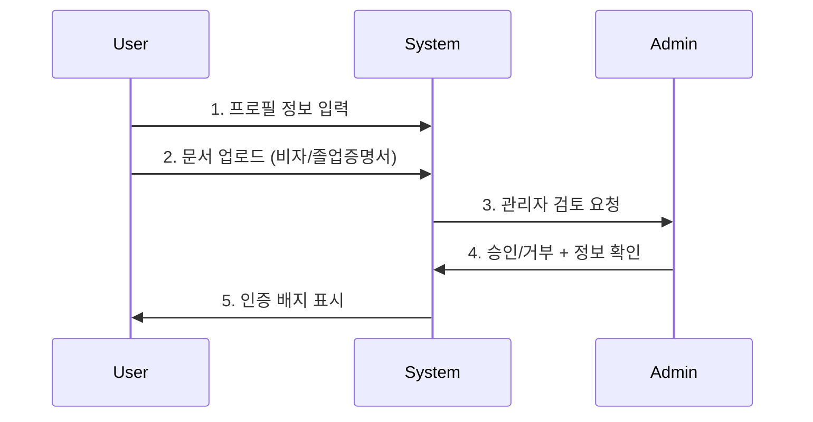

# 🇻🇳 Viet K-Connect 통합 마스터 플랜

**베트남인 한국생활 Q&A 플랫폼 - 완전 통합 문서**

---

## 📋 프로젝트 정보

- **프로젝트명**: Viet K-Connect
- **버전**: v2.1 (인증 시스템 + 배너 시스템)
- **현재 브랜치**: feature/issue-42-questionlist
- **완성도**: 67% → 85% 목표
- **최종 업데이트**: 2025-10-05

---

## 🎯 프로젝트 개요

### 비전
한국에 거주하는 베트남인들이 **신뢰할 수 있는 전문가**로부터 빠르고 정확한 정보를 얻는 Q&A 플랫폼

### 핵심 차별화 전략
```yaml
vs_기존_커뮤니티:
  네이버_카페: "익명성" → "문서 기반 실명 인증"
  페이스북_그룹: "답변자 경험 불명확" → "비자타입·거주년차·전문분야 표시"
  오픈채팅: "정보 산재" → "체계적 분류 + 검색"
  광고_많음: "광고 없는 깔끔한 UI" → "가치 제안 배너"
```

### MVP 핵심 기능 (2주 완성)
1. **기본 Q&A**: 질문 작성 → 답변 → 채택
2. **Google 로그인**: 진입장벽 최소화
3. **🎯 인증 시스템**: 문서 기반 수동 인증
4. **🎯 배너 시스템**: 빈 공간 가치 제안 활용
5. **모바일 최적화**: 80% 모바일 사용자 대응

---

## 🏗️ 기술 아키텍처

### 핵심 기술 스택
```typescript
Frontend:
  - Next.js 14 (App Router) + TypeScript 5.0
  - Tailwind CSS + shadcn/ui
  - React 기본 상태관리

Backend:
  - Supabase (PostgreSQL 14 + Auth + Storage)
  - Google OAuth (단일 로그인)
  - Vercel 호스팅

제거된_복잡한_기술:
  ❌ AI: OpenAI GPT (Phase 3로 연기)
  ❌ 다중 알림: 카카오/SendGrid (이메일만)
  ❌ 복잡한 상태관리: Zustand (React 기본)
```

### 데이터베이스 스키마 (6개 테이블)
```sql
-- 1. 사용자 (차별화 요소 포함)
users (
  id, email, name, avatar_url,
  🎯 visa_type,        -- 'D-2', 'E-7', 'F-2', 'F-5'
  🎯 years_in_korea,   -- 거주년차 1-10년
  🎯 university,       -- 대학/회사명
  🎯 verification_status, -- 'unverified', 'pending', 'verified'
  🎯 specialties       -- ['비자', '취업', '생활정보']
)

-- 2. 질문 (기본)
questions (id, title, content, author_id, category_id, view_count, status)

-- 3. 답변 (단순)
answers (id, content, question_id, author_id, is_accepted)

-- 4. 카테고리 (5개 고정)
categories (id, name, icon, color) -- '비자', '취업', '생활정보', '주거', '의료'

-- 5. 🎯 수동 인증 시스템
user_verifications (
  id, user_id, document_type, document_url,
  status, admin_notes, reviewed_by
)

-- 6. 🎯 배너 시스템
site_banners (
  id, position, title, content, target_audience,
  is_active, display_order
)
```

---

## 🔐 인증 시스템 (핵심 차별화)

### 3단계 인증 프로세스


### 문서 유형 및 요구사항
```typescript
const verificationDocs = {
  visa: {
    required: true,
    formats: ['PDF', 'JPG', 'PNG'],
    maxSize: '5MB',
    purpose: '비자 타입 확인으로 답변 신뢰도 보장'
  },
  diploma: {
    required: false,
    formats: ['PDF', 'JPG', 'PNG'],
    maxSize: '3MB',
    purpose: '학력 수준 표시로 전문성 인증'
  },
  employment: {
    required: false,
    formats: ['PDF'],
    maxSize: '2MB',
    purpose: '재직 상태 확인으로 경력 인증'
  }
};
```

### 인증 혜택 시스템
- **🔸 미인증**: 기본 질문/답변 가능
- **🔸 인증 대기**: "검토 중" 배지 표시
- **🔸 인증 완료**:
  - ✅ 인증 배지 + 비자타입 + 거주년차 표시
  - 답변 우선 노출
  - 전문가 네트워크 형성

---

## 🎨 배너 & 가치 제안 시스템

### 빈 공간 활용 전략
```css
/* 광고 없는 공간을 가치 제안으로 전환 */
.value-banner-positions {
  header-banner: "상단 전체 폭 활용";
  sidebar-trust: "우측 신뢰 시스템 설명";
  floating-help: "우하단 고정 도움말";
  content-between: "질문 목록 사이 삽입";
  footer-community: "하단 커뮤니티 통계";
}
```

### 사용자별 가치 제안 메시지
```typescript
const bannerMessages = {
  // 게스트 사용자
  guests: {
    title: "🔐 신뢰할 수 있는 답변",
    content: "비자타입·거주년차 확인으로 정확한 정보만",
    cta: "구글로 3초 가입하기"
  },

  // 미인증 사용자
  unverified: {
    title: "📋 전문가 인증받기",
    content: "비자 문서 인증으로 답변 신뢰도 높이기",
    cta: "인증 신청하기"
  },

  // 인증 사용자
  verified: {
    title: "🎖️ 인증 전문가",
    content: "회원님의 경험을 나누어 주세요",
    cta: "질문 답변하기"
  }
};
```

### 경쟁사 대비 우위 강조
- **vs 네이버 카페**: "익명 vs 실명 인증"
- **vs 페이스북 그룹**: "경험 불명 vs 전문성 표시"
- **vs 오픈채팅**: "정보 산재 vs 체계적 분류"
- **vs 광고 사이트**: "광고 많음 vs 깔끔한 UI"

---

## 📅 2주 MVP 실행 계획

### 🔥 Week 1: 핵심 기능 구현 (10/06-10/12)

#### 월요일 - QuestionList 완성
- [x] 현재 브랜치 `feature/issue-42-questionlist` 완료
- [ ] 필터링 (5개 카테고리) + 무한 스크롤
- [ ] 단순 검색 (제목, 내용) + 모바일 최적화

#### 화요일 - 질문 작성 시스템
- [ ] 간단한 텍스트 에디터 (위지윅 제거)
- [ ] 기본 이미지 업로드 (1장만)
- [ ] 카테고리 선택 (5개 중 1개)

#### 수요일 - 답변 시스템
- [ ] 답변 작성/수정/삭제
- [ ] 답변 채택 기능
- [ ] 기본 UI 구현

#### 목요일 - Supabase 연결
- [ ] 실제 데이터베이스 연결 + API 테스트
- [ ] 환경변수 설정 + RLS 정책 확인

#### 금요일 - 🎯 인증 + 배너 시스템
- [ ] Google OAuth 연동
- [ ] **문서 업로드 시스템** (비자, 졸업증명서)
- [ ] **관리자 대시보드** (검토/승인 기능)
- [ ] **배너 컨텐츠 관리** 시스템
- [ ] **가치 제안 배너** (신뢰도, 전문성, 커뮤니티 강점)

### 🚀 Week 2: 인증 시스템 완성 (10/13-10/19)

#### 월-화 - 인증 시스템 UI/UX
- [ ] 인증 배지 표시 시스템 (미인증/대기/완료)
- [ ] 비자 타입 및 거주년차 표시 통합
- [ ] 인증 단계별 안내 페이지
- [ ] 배너 시스템 적용 (위치별 컴포넌트)

#### 수-목 - 관리자 도구 + 베타 테스트
- [ ] 관리자 대시보드 완성 (인증 대기 목록)
- [ ] 문서 뷰어 및 승인/거부 기능
- [ ] 배너 컨텐츠 관리 도구
- [ ] 베타 사용자 모집 (베트남 커뮤니티)

#### 금요일 - MVP 베타 출시 (v2.1)
- [ ] 전체 시스템 통합 테스트
- [ ] 인증 시스템 + 배너 시스템 최종 테스트
- [ ] 프로덕션 배포 (viet-kconnect.vercel.app)
- [ ] 베타 런칭 공지 (인증 시스템 강점 포함)

---

## 📊 성공 지표 & 위험 관리

### MVP 성공 기준 (2주 후)
- ✅ 기본 CRUD 기능 100% 작동
- ✅ **인증 시스템 정상 동작** (문서 업로드 → 관리자 검토 → 배지 표시)
- ✅ **배너 시스템 효과 측정** (클릭률, 가입 전환율)
- ✅ 베타 사용자 30명 이상 가입
- ✅ 모바일 반응성 완벽 구현

### 사용자 확보 목표 (6주 후)
- 🎯 주간 활성 사용자 100명
- 🎯 **인증 사용자 30명 이상** (전체 사용자의 30%)
- 🎯 질문 작성 주 10개 이상
- 🎯 답변률 60% 이상 (인증 사용자 중심)

### 위험 요소 & 대응
1. **인증 처리 지연**:
   - 관리자 24시간 내 처리 목표
   - 자동 리마인더 시스템
2. **문서 보안 문제**:
   - Supabase Storage 암호화
   - 관리자만 접근 가능
3. **배너 효과 미비**:
   - A/B 테스트로 메시지 최적화
   - 클릭률 실시간 모니터링

---

## 🎯 Phase 2: 확장 계획 (4주)

### Week 3-4: 사용자 확보 + 인증 시스템 고도화
- **마케팅**: 베트남 커뮤니티 홍보 (인증 시스템 강점 어필)
- **콘텐츠**: 시드 질문 100개 + 인증 전문가 10명 확보
- **개선**: 인증 프로세스 자동화 검토 (사용자 200명 이후)

### Week 5-6: 피드백 기반 최적화
- **분석**: 인증 사용자 vs 미인증 사용자 답변 품질 비교
- **배너 최적화**: 클릭률 및 전환율 기반 메시지 개선
- **기능 추가**: 실제 요청 기반 (댓글, 투표 등)

---

## 💰 비용 구조 & ROI

### 개발 비용
- **MVP (2주)**: $0 (외부 서비스 없음)
- **운영 비용**: $0/월 (Supabase Free tier)
- **확장 시**: $25/월 (Supabase Pro, 사용자 500명+)


---

## 🔄 버전 히스토리

### v2.1 (2025-10-05) - 현재 버전
- ✅ 수동 인증 시스템 설계 완료
- ✅ 배너 & 가치 제안 시스템 설계 완료
- ✅ 문서 통합 정리

### v2.0 (2025-10-05) - MVP 재설계
- ✅ 복잡한 기능 70% 제거 (AI, 다중 알림, 번역)
- ✅ 개발 기간 8주 → 6주 단축
- ✅ 비용 월 $200+ → $0 절약

### v1.0 (2025-10-04) - 초기 계획
- ❌ 8개 Agent 병렬 시스템 (과도한 복잡성)
- ❌ AI 기반 질문 분류 및 매칭
- ❌ 다중 채널 알림 시스템

---

## ✅ 즉시 실행 가능

### 현재 상태
- **기술 스택**: 100% 준비 완료
- **설계 문서**: 완전 통합 완료
- **구현 계획**: 일별 상세 계획 수립
- **차별화 전략**: 명확한 경쟁 우위 확보

### 다음 단계
1. **월요일**: QuestionList 완성부터 시작
2. **일일 진행**: 계획된 기능 순차 구현
3. **금요일**: 인증 + 배너 시스템 통합
4. **2주 후**: 베타 출시 (인증 시스템 강점 어필)

**🚀 모든 준비 완료. 즉시 개발 착수 가능합니다.**

---

*📄 통합 마스터 플랜 v2.1*
*📅 최종 업데이트: 2025-10-05*
*🎯 목표: 2주 내 MVP 베타 출시*