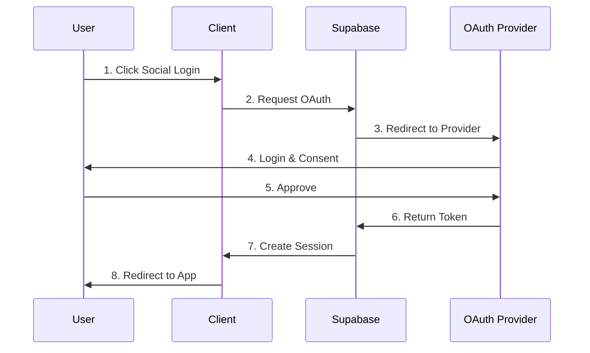

# Viet K-Connect 기술 문서 (통합본)

✅ **활성 개발 중인 기술 문서**

---

## 📋 문서 개요

이 문서는 Viet K-Connect 프로젝트의 기술적 설계와 구현 방법을 정리한 문서입니다.

---

## 🏗️ 시스템 아키텍처

### 전체 아키텍처 다이어그램
```
┌─────────────────────────────────────────────────────────────┐
│                         CLIENT LAYER                         │
├─────────────────┬───────────────────┬───────────────────────┤
│   Web Browser   │   Mobile PWA      │   Google Translate    │
│   (Desktop)     │   (iOS/Android)   │   (Extension)         │
└────────┬────────┴────────┬──────────┴───────────┬───────────┘
         │                 │                      │
         └─────────────────┼──────────────────────┘
                           │
                    ┌──────▼──────┐
                    │   Vercel    │
                    │  (CDN/Edge)  │
                    └──────┬──────┘
                           │
┌──────────────────────────▼──────────────────────────────────┐
│                     APPLICATION LAYER                        │
├──────────────────────────────────────────────────────────────┤
│                    Next.js 14 (App Router)                   │
│  ┌────────────┬─────────────┬──────────────┬────────────┐  │
│  │   Pages    │   API       │   Components │   Hooks    │  │
│  │  /auth     │  /api/auth  │   /ui        │  useAuth   │  │
│  │  /questions│  /api/qa    │   /features  │  useQuery  │  │
│  │  /admin    │  /api/ai    │   /shared    │  useNotify │  │
│  └────────────┴─────────────┴──────────────┴────────────┘  │
└──────────────────────────────────────────────────────────────┘
                           │
┌──────────────────────────▼──────────────────────────────────┐
│                      SERVICE LAYER                           │
├─────────────┬──────────────┬─────────────┬─────────────────┤
│  Supabase   │   OpenAI     │   Kakao     │    SendGrid     │
│  - Auth     │   GPT-3.5    │   - OAuth   │    Email API    │
│  - Database │   - Classify │   - Share   │                 │
│  - Storage  │   - Match    │   - Alimtalk│                 │
│  - Realtime │              │             │                 │
└─────────────┴──────────────┴─────────────┴─────────────────┘
```

### 핵심 기술 스택
```yaml
Frontend:
  Framework: Next.js 14 (App Router)
  Language: TypeScript 5.0
  Styling: Tailwind CSS 3.0 + shadcn/ui
  State: Zustand 4.0
  HTTP: Axios / Native Fetch

Backend:
  Runtime: Node.js 18 (Vercel Edge)
  Database: PostgreSQL 14 (Supabase)
  Auth: Supabase Auth (OAuth)
  Storage: Supabase Storage

AI & APIs:
  AI: OpenAI GPT-3.5-turbo
  Translation: Google Chrome (MVP)
  Notifications: Kakao API + SendGrid
  Analytics: Google Analytics 4

DevOps:
  Hosting: Vercel
  CDN: CloudFlare
  CI/CD: GitHub Actions
```

---

## 💾 데이터베이스 설계

### 핵심 테이블 구조
```sql
-- Users (간소화)
CREATE TABLE users (
  id UUID PRIMARY KEY DEFAULT gen_random_uuid(),
  email VARCHAR(255) UNIQUE NOT NULL,
  name VARCHAR(100) NOT NULL,
  avatar_url TEXT,
  provider VARCHAR(50), -- 'kakao', 'google', 'facebook'

  -- Optional Info (진입장벽 낮춤)
  visa_type VARCHAR(20),
  company VARCHAR(100),
  years_in_korea INTEGER,
  region VARCHAR(50),
  preferred_language VARCHAR(10) DEFAULT 'ko',

  -- Badges (레벨/포인트 제거)
  badges JSONB DEFAULT '{
    "senior": false,
    "expert": false,
    "verified": false,
    "helper": false
  }'::jsonb,

  created_at TIMESTAMPTZ DEFAULT NOW(),
  last_active TIMESTAMPTZ DEFAULT NOW()
);

-- Questions
CREATE TABLE questions (
  id UUID PRIMARY KEY DEFAULT gen_random_uuid(),
  author_id UUID REFERENCES users(id),
  title VARCHAR(200) NOT NULL,
  content TEXT NOT NULL,

  -- AI Classification
  category_id INTEGER NOT NULL,
  ai_category_confidence FLOAT,
  tags TEXT[],
  urgency VARCHAR(20) DEFAULT 'NORMAL',

  -- Smart Matching
  matched_experts UUID[],

  -- Metadata
  view_count INTEGER DEFAULT 0,
  answer_count INTEGER DEFAULT 0,
  status VARCHAR(20) DEFAULT 'open',

  created_at TIMESTAMPTZ DEFAULT NOW(),
  updated_at TIMESTAMPTZ DEFAULT NOW()
);

-- Answers
CREATE TABLE answers (
  id UUID PRIMARY KEY DEFAULT gen_random_uuid(),
  question_id UUID REFERENCES questions(id),
  author_id UUID REFERENCES users(id),
  content TEXT NOT NULL,

  is_accepted BOOLEAN DEFAULT false,
  helpful_count INTEGER DEFAULT 0,

  created_at TIMESTAMPTZ DEFAULT NOW(),
  updated_at TIMESTAMPTZ DEFAULT NOW()
);
```

---

## 🎨 UI/UX 설계

### 디자인 원칙
1. **Mobile First**: 360px 기준 설계
2. **낮은 진입장벽**: 로그인 없이 콘텐츠 열람
3. **신뢰 시각화**: 레벨, 뱃지, 거주년차 표시
4. **단순함**: 광고 없이 핵심 기능에 집중

### 색상 시스템
```css
:root {
  /* Primary Colors */
  --primary: #EA4335;      /* 베트남 국기 빨강 */
  --secondary: #FFCD00;    /* 베트남 국기 노랑 */

  /* Trust Colors */
  --verified: #10B981;     /* 인증 초록 */
  --expert: #F59E0B;       /* 전문가 골드 */

  /* UI Colors */
  --background: #FFFFFF;
  --surface: #F9FAFB;
  --border: #E5E7EB;
  --text-primary: #111827;
  --text-secondary: #6B7280;
}
```

### A/B 테스트 UI 설계

#### Version A: 질문 우선형 (기본)
- 질문 작성 폼이 상단에 배치
- 인기 Q&A 목록 중심
- CTA: "질문하기" 버튼 강조

#### Version B: 검색 우선형
- 검색바가 상단에 배치
- 카테고리별 답변 목록 중심
- CTA: "검색하기" 중심

### 모바일 반응형 설계
```scss
// 브레이크포인트
$mobile: 360px;   // 기준 화면
$tablet: 768px;   // 태블릿
$desktop: 1024px; // 데스크톱

// 터치 친화적 요소
.touch-target {
  min-height: 44px; // iOS 기준
  min-width: 44px;
  padding: 12px;
}

// Bottom Navigation (모바일)
.bottom-nav {
  position: fixed;
  bottom: 0;
  height: 56px;
  padding-bottom: env(safe-area-inset-bottom);
}
```

---

## 🔐 인증 시스템

### 간소화된 OAuth 플로우


### 권한 체계
```typescript
enum UserRole {
  GUEST = 'guest',        // 비로그인 사용자
  USER = 'user',          // 일반 회원
  VERIFIED = 'verified',  // 인증 회원 (선택)
  ADMIN = 'admin'         // 관리자
}
```

---

## 🤖 AI 기능 구현

### 질문 분류 시스템
```typescript
interface AIProcessingPipeline {
  // Step 1: Receive Question
  input: {
    title: string;
    content: string;
    userLanguage: 'ko' | 'vi' | 'en';
  };

  // Step 2: GPT-3.5 Classification
  classification: {
    model: 'gpt-3.5-turbo';
    prompt: 'Classify Korean life question';
    response: {
      category: string;
      confidence: number;
      urgency: 'LOW' | 'MEDIUM' | 'HIGH' | 'URGENT';
      tags: string[];
    };
  };

  // Step 3: Expert Matching
  matching: {
    algorithm: 'score_based';
    factors: {
      categoryMatch: 0.4;
      visaTypeMatch: 0.3;
      verifiedStatus: 0.2;
      responseRate: 0.1;
    };
    output: Expert[5]; // Top 5 experts
  };
}
```

### AI 비용 최적화
```javascript
const AI_CACHE_STRATEGY = {
  // Cache similar questions
  similarityThreshold: 0.85,

  // Cache duration
  ttl: {
    classification: 3600, // 1 hour
    matching: 1800, // 30 minutes
  },

  // Rate limiting
  rateLimit: {
    perUser: 10, // per hour
    global: 1000, // per hour
  },

  // Estimated costs
  monthlyCost: {
    withoutCache: "$150/month",
    withCache: "$30/month" // 80% reduction
  }
};
```

---

## 🌐 번역 전략

### Phase 1: MVP (구글 번역 활용)
```typescript
const TranslationStrategy = {
  phase: "MVP",
  approach: "Browser-based",
  implementation: {
    desktop: "Chrome/Edge auto-translate",
    mobile: "Chrome mobile translation",
    fallback: "User manual copy-paste"
  },
  userGuidance: {
    ko: "Chrome 번역 기능을 사용하세요",
    vi: "Sử dụng tính năng dịch của Chrome",
    en: "Use Chrome translation feature"
  },
  cost: 0,
  devTime: "0 days"
};
```

### Phase 2: 하이브리드 번역 (향후)
```typescript
const HybridTranslation = {
  // Priority 1: UI Elements (i18n)
  staticContent: {
    method: "i18next",
    languages: ['ko', 'vi', 'en'],
    files: "locales/*.json",
    cost: 0
  },

  // Priority 2: Critical Content
  dynamicContent: {
    method: "Google Translate API",
    targets: ["categories", "system_messages", "faq_titles"],
    cost: "$20/month"
  },

  // Priority 3: User Content
  userContent: {
    method: "Browser translation",
    reason: "Cost optimization",
    cost: 0
  }
};
```

---

## 📱 PWA 및 모바일 최적화

### PWA 설정
```javascript
// next.config.js
const withPWA = require('next-pwa')({
  dest: 'public',
  register: true,
  skipWaiting: true,
  disable: process.env.NODE_ENV === 'development'
});

// manifest.json
{
  "name": "Viet K-Connect",
  "short_name": "VKC",
  "description": "베트남인 한국생활 Q&A",
  "start_url": "/",
  "display": "standalone",
  "orientation": "portrait",
  "theme_color": "#10B981",
  "background_color": "#ffffff"
}
```

### Bottom Sheet 구현
```tsx
// Bottom Sheet Component
interface BottomSheetProps {
  isOpen: boolean
  onClose: () => void
  children: React.ReactNode
  title?: string
}

export function BottomSheet({ isOpen, onClose, children, title }: BottomSheetProps) {
  return (
    <AnimatePresence>
      {isOpen && (
        <>
          <motion.div
            initial={{ opacity: 0 }}
            animate={{ opacity: 0.5 }}
            exit={{ opacity: 0 }}
            className="fixed inset-0 bg-black z-40"
            onClick={onClose}
          />
          <motion.div
            initial={{ y: '100%' }}
            animate={{ y: 0 }}
            exit={{ y: '100%' }}
            className="fixed bottom-0 left-0 right-0 bg-white rounded-t-2xl z-50"
          >
            {children}
          </motion.div>
        </>
      )}
    </AnimatePresence>
  )
}
```

---

## 🔔 알림 시스템

### 다중 채널 알림
```typescript
interface NotificationSystem {
  channels: {
    inApp: {
      technology: "Supabase Realtime",
      latency: "<100ms",
      cost: "Free"
    },
    push: {
      technology: "FCM (Firebase)",
      latency: "<1s",
      cost: "Free (10k/month)"
    },
    kakaoTalk: {
      technology: "Kakao Alimtalk API",
      latency: "<3s",
      cost: "₩20/message"
    },
    email: {
      technology: "SendGrid",
      latency: "<5s",
      cost: "Free (100/day)"
    }
  };

  types: {
    newAnswer: ["inApp", "push", "kakaoTalk"],
    expertMatch: ["inApp", "push"],
    answerAccepted: ["inApp", "email"],
    weeklyDigest: ["email"]
  };
}
```

---

## 🚀 배포 및 성능 최적화

### 배포 아키텍처
```yaml
Production Environment:
  Hosting:
    - Platform: Vercel
    - Region: Asia (Seoul - icn1)
    - Type: Serverless Functions

  Database:
    - Provider: Supabase
    - Type: PostgreSQL 14
    - Region: Asia Pacific (Seoul)

  Monitoring:
    - Analytics: Google Analytics 4
    - Errors: Sentry
    - Uptime: Vercel Analytics
```

### 성능 최적화
```typescript
// Frontend Optimization
const FrontendOptimization = {
  bundleSize: {
    target: "<200KB initial",
    techniques: [
      "Code splitting",
      "Tree shaking",
      "Dynamic imports",
      "Image optimization"
    ]
  },

  caching: {
    static: "30 days",
    api: "5 minutes",
    images: "7 days"
  },

  rendering: {
    strategy: "ISR (Incremental Static Regeneration)",
    revalidate: 60, // seconds
    fallback: true
  }
};
```

---

## 🔒 보안 설정

### 보안 계층
```typescript
const AppSecurity = {
  authentication: {
    provider: "Supabase Auth",
    methods: ["OAuth 2.0"],
    session: "JWT (HttpOnly Cookie)",
    refresh: "Automatic"
  },

  authorization: {
    method: "Row Level Security (RLS)",
    policies: [
      "Users can read all questions",
      "Users can edit own content",
      "Admins can moderate all"
    ]
  },

  dataProtection: {
    encryption: "TLS 1.3",
    database: "AES-256",
    passwords: "Not stored (OAuth only)",
    pii: "Minimal collection"
  }
};
```

### 보안 구현 우선순위

| Category | Feature | Implementation | Level | Priority |
|----------|---------|---------------|--------|----------|
| **Authentication** | | | | |
| | OAuth 2.0 | Supabase Auth with Kakao/Google/Facebook | High | P0 |
| | Session Management | JWT with HttpOnly Cookies | High | P0 |
| | Refresh Token | Automatic token refresh | High | P0 |
| | MFA | Two-factor authentication | Medium | P2 |
| **Authorization** | | | | |
| | Row Level Security | PostgreSQL RLS policies | High | P0 |
| | Role-based Access | User/Admin/Guest roles | High | P0 |
| | API Protection | Middleware authentication check | High | P0 |
| | Resource Limits | Rate limiting per user | Medium | P1 |
| **Data Protection** | | | | |
| | Encryption in Transit | TLS 1.3 | High | P0 |
| | Database Encryption | AES-256 | High | P0 |
| | PII Handling | Minimal collection, anonymization | High | P0 |
| | Backup & Recovery | Daily automated backups | High | P1 |
| **Content Security** | | | | |
| | Input Validation | XSS/SQL injection prevention | High | P0 |
| | File Upload Scanning | Malware/virus scanning | Medium | P1 |
| | Content Moderation | AI-based inappropriate content detection | Medium | P1 |
| | CORS Policy | Strict origin validation | High | P0 |

### RLS (Row Level Security) Policies

```sql
-- Questions: Everyone can read, authors can edit
CREATE POLICY "Questions are viewable by everyone"
ON questions FOR SELECT
USING (true);

CREATE POLICY "Users can create questions"
ON questions FOR INSERT
WITH CHECK (auth.uid() = author_id);

CREATE POLICY "Users can update own questions"
ON questions FOR UPDATE
USING (auth.uid() = author_id);

-- Answers: Everyone can read, authors can edit
CREATE POLICY "Answers are viewable by everyone"
ON answers FOR SELECT
USING (true);

CREATE POLICY "Authenticated users can create answers"
ON answers FOR INSERT
WITH CHECK (auth.uid() IS NOT NULL);

CREATE POLICY "Users can update own answers"
ON answers FOR UPDATE
USING (auth.uid() = author_id);

-- Users: Public profiles visible, private data protected
CREATE POLICY "Public profiles are viewable"
ON users FOR SELECT
USING (true);

CREATE POLICY "Users can update own profile"
ON users FOR UPDATE
USING (auth.uid() = id);

-- Notifications: Users see only their notifications
CREATE POLICY "Users can view own notifications"
ON notifications FOR SELECT
USING (auth.uid() = user_id);
```

---

## 📊 성능 지표 및 모니터링

### 추적할 주요 메트릭
```javascript
const UI_METRICS = {
  // 진입 전환율
  landingToSignup: "30%",      // 방문 → 가입
  guestToUser: "25%",          // 게스트 → 회원

  // 인터랙션
  questionCompletion: "70%",    // 질문 작성 완료율
  searchToQuestion: "15%",      // 검색 → 질문 전환

  // 모바일
  mobileUsage: "80%",          // 모바일 사용 비율
  appInstall: "40%",           // PWA 설치율

  // A/B 테스트
  versionAPreference: "60%",    // 질문 우선형 선호
  versionBPreference: "40%",    // 검색 우선형 선호
};
```

---

## 📝 API 명세 상세

### Authentication Endpoints

#### POST /api/auth/login
```typescript
// Request
{
  provider: 'kakao' | 'google' | 'facebook',
  token: string
}

// Response
{
  user: {
    id: string,
    email: string,
    name: string,
    avatar_url?: string
  },
  jwt: string,
  refreshToken: string
}
```

#### POST /api/auth/logout
```typescript
// Request
{
  refreshToken: string
}

// Response
{
  success: boolean
}
```

#### GET /api/auth/session
```typescript
// Response
{
  user: User | null,
  isAuthenticated: boolean
}
```

### Question Endpoints

#### GET /api/questions
```typescript
// Query Parameters
{
  category?: number,
  status?: 'open' | 'closed' | 'solved',
  page?: number,
  limit?: number,
  sort?: 'latest' | 'popular' | 'unanswered'
}

// Response
{
  questions: Question[],
  total: number,
  page: number,
  hasMore: boolean
}
```

#### POST /api/questions
```typescript
// Request
{
  title: string,
  content: string,
  category?: number,
  urgency?: 'normal' | 'urgent',
  visibility?: 'public' | 'verified_only'
}

// Response
{
  questionId: string,
  aiCategory: number,
  aiTags: string[],
  matchedExperts: User[],
  createdAt: string
}
```

#### GET /api/questions/:id
```typescript
// Response
{
  question: {
    id: string,
    title: string,
    content: string,
    author: User,
    category: Category,
    tags: Tag[],
    viewCount: number,
    answerCount: number,
    createdAt: string,
    updatedAt: string
  },
  answers: Answer[],
  relatedQuestions: Question[]
}
```

### Answer Endpoints

#### POST /api/questions/:id/answers
```typescript
// Request
{
  content: string,
  images?: string[]
}

// Response
{
  answerId: string,
  createdAt: string
}
```

#### POST /api/answers/:id/accept
```typescript
// Response
{
  success: boolean,
  pointsAwarded: number
}
```

### AI Endpoints

#### POST /api/ai/classify
```typescript
// Request
{
  title: string,
  content: string,
  userLanguage: 'ko' | 'vi' | 'en'
}

// Response
{
  category: {
    id: number,
    name: string,
    confidence: number
  },
  tags: string[],
  urgency: 'low' | 'medium' | 'high' | 'urgent',
  similarQuestions: {
    id: string,
    title: string,
    similarity: number
  }[]
}
```

#### POST /api/ai/match
```typescript
// Request
{
  questionId: string,
  category: number,
  tags: string[]
}

// Response
{
  experts: {
    user: User,
    score: number,
    matchReasons: string[],
    responseRate: number,
    avgResponseTime: string
  }[],
  notificationsSent: number
}
```

### Notification Endpoints

#### GET /api/notifications
```typescript
// Query Parameters
{
  unreadOnly?: boolean,
  type?: 'answer' | 'comment' | 'accept' | 'mention',
  limit?: number
}

// Response
{
  notifications: Notification[],
  unreadCount: number
}
```

---

## 🎯 핵심 설계 원칙

### The 4 Pillars
1. **Trust**: 실명, 인증, 레벨로 신뢰 구축
2. **Speed**: 최대 24시간 답변 보장
3. **Smart**: AI 매칭으로 최적 답변자 연결
4. **Simple**: 10초 가입, 직관적 UI

### 성공 지표
- 기술적: 로딩 2초 이내, 에러율 1% 미만, AI 정확도 80%+
- 비즈니스: 베타 사용자 50명+, 답변률 60%+, NPS 30+

--

---

*이 문서는 레거시 프로젝트의 기술 설계를 통합한 참고 문서입니다.*
*실제 구현은 `/Users/bk/Desktop/viet-kconnect/`에서 진행하세요.*