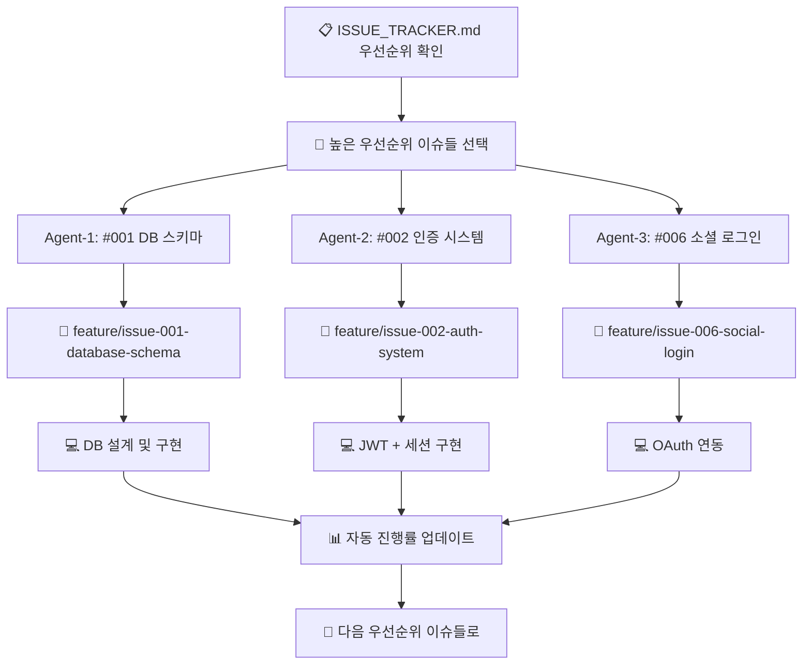
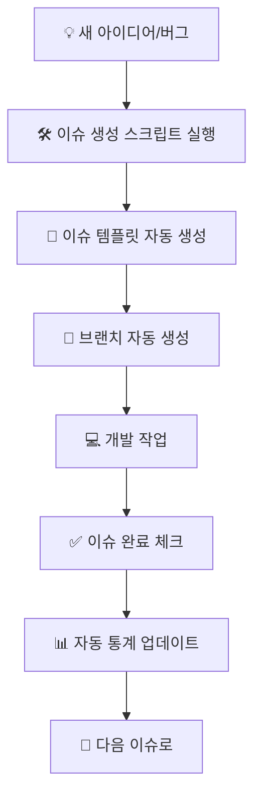

# 🎯 Viet K-Connect 통합 이슈 관리 시스템

**📅 마지막 업데이트**: 2025년 9월 28일  
**🚀 프로젝트**: Viet K-Connect (베트남 커뮤니티 Q&A 플랫폼)  
**🔀 현재 브랜치**: `feature/issue-010-014-batch`  
**📊 전체 진행률**: 15% (Phase 1: 프로젝트 정리 완료)  
**🛠️ 자동화 상태**: ✅ GitHub CLI 연동 완료  
**📋 통합 문서**: 이슈 추적 + 자동화 + 가이드 + 워크플로우 ALL-IN-ONE

---

## 📖 **목차 (Table of Contents)**

1. [📋 현재 이슈 현황](#-현재-이슈-현황)
2. [🎯 스프린트 정보](#-스프린트-정보)
3. [📊 마일스톤 연동](#-마일스톤-연동)
4. [🛠️ 자동화 도구 & 시스템](#-자동화-도구--시스템)
5. [🔄 워크플로우 가이드](#-워크플로우-가이드)
6. [📈 성과 지표 & KPI](#-성과-지표--kpi)
7. [🚨 문제해결 가이드](#-문제해결-가이드)
8. [🎉 확장 계획](#-확장-계획)

---

## 📋 **현재 이슈 현황**

### 🔄 **진행 중 (In Progress)**

| 이슈 번호 | 제목 | 우선순위 | 담당자 | 진행률 | 마감일 | 브랜치 |
|-----------|------|----------|--------|--------|--------|---------|
| #40 | [Migration] Next.js 14 프로젝트 구조 복원 | 🔴 높음 | Agent-2 | 0% | 2025-10-02 | feature/nextjs-structure |
| #41 | [Migration] Supabase 프로젝트 초기 설정 | 🔴 높음 | Agent-3 | 0% | 2025-10-03 | feature/supabase-setup |
| #42 | [Migration] 인증 시스템 마이그레이션 | 🔴 높음 | Agent-4 | 0% | 2025-10-05 | feature/auth-migration |

### ✅ **완료됨 (Completed)**

| 이슈 번호 | 제목 | 완료일 | 담당자 | 소요시간 |
|-----------|------|--------|--------|----------|
| #10-39 | GitHub 이슈 정리 및 통합 | 2025-09-29 | Agent-1 | 1시간 |
| Milestone | Next.js + Supabase Migration 마일스톤 생성 | 2025-09-29 | Agent-1 | 30분 |

### 📋 **백로그 (Backlog)**

| 이슈 번호 | 제목 | 우선순위 | 담당자 | 계획 시작일 | 브랜치 |
|-----------|------|----------|----------|------------|---------|
| #43 | [Migration] CRUD API 및 데이터 관리 | 🟡 보통 | Agent-5 | 2025-10-10 | feature/crud-api |
| #44 | [Migration] 소셜 로그인 통합 | 🔴 높음 | Agent-6 | 2025-10-12 | feature/social-login |
| #45 | [Migration] 컴포넌트 라이브러리 마이그레이션 | 🟡 보통 | Agent-7 | 2025-10-15 | feature/component-migration |
| #46 | [Migration] 테스트 환경 구축 | 🟡 보통 | Agent-8 | 2025-10-18 | feature/testing-setup |
| #47 | [Migration] 배포 및 최종 통합 | 🟢 낮음 | 통합팀 | 2025-10-25 | feature/final-integration |

---

## 🎯 **스프린트 정보**

### **Sprint 1: 백엔드 인프라 구축**
- **🗓️ 기간**: 2025-09-19 ~ 2025-10-02 (2주)
- **🎯 목표**: 데이터베이스 및 인증 시스템 완성
- **📊 진행률**: 60% (3/5 이슈 완료)
- **⏰ 남은 일수**: 4일

**주요 작업 항목:**
- [x] ✅ 프로젝트 구조 정리
- [x] ✅ Next.js 14 환경 구축
- [x] ✅ Supabase 연동
- [ ] 🔄 데이터베이스 스키마 완성 (진행중)
- [ ] 📅 기본 인증 API 구현

### **Sprint 2: 핵심 기능 개발** (예정)
- **🗓️ 기간**: 2025-10-03 ~ 2025-10-16 (2주)
- **🎯 목표**: Q&A 시스템과 AI 기능 구현
- **📊 예상 작업량**: 89 Story Points

---

## 📊 **마일스톤 연동**

### 🚀 **Phase 2: 핵심 기능 개발** (2025-10-28 마감)
**연결된 이슈**: #001, #002, #003, #004, #006  
**진행률**: 15% (1/5 완료)

### ✨ **핵심 기능 구현** (2025-10-19 마감)
**연결된 이슈**: #005, #007, #008  
**진행률**: 0% (0/3 완료)

### 📚 **문서화 완성** (2025-10-12 마감)
**연결된 이슈**: 자동 생성 예정  
**진행률**: 30% (문서 구조 완성)

---

## 🛠️ **자동화 도구 & 시스템 구성**

### **📁 시스템 구조**
```
viet-kconnect/
├── 📊 ISSUE_TRACKER.md              ← 🎯 메인 이슈 관리 허브 (이 파일)
├── 📈 docs/milestone-status.md      ← 마일스톤 및 통계
├── 🛠️ scripts/create-issue.sh       ← 이슈 생성 자동화 스크립트
├── 🤖 .github/workflows/
│   └── issue-tracker-automation.yml ← GitHub Actions 자동화
└── 📝 docs/issues/                  ← 개별 이슈 상세 문서
    ├── ISSUE-001.md
    ├── ISSUE-002.md
    └── ...
```

### **🎯 이슈 자동 생성 스크립트** ✅ **완전 설정 완료!**

#### **GitHub CLI 연동 상태**
```bash
# GitHub CLI 설치 및 인증 완료 ✅
gh --version  # v2.80.0
gh auth status  # ✅ leesangbok1 계정 로그인됨 (35개 이슈 확인됨)
```

#### **사용법**
```bash
# 기본 문법
./scripts/create-issue.sh "이슈 제목" "우선순위" "담당자" "Story Points"

# 실제 사용 예시
./scripts/create-issue.sh "카카오 로그인 구현" "high" "@bk" "8"
./scripts/create-issue.sh "UI 버그 수정" "medium" "@bk" "3"
./scripts/create-issue.sh "성능 최적화" "low" "@bk" "5"
```

#### **자동 실행되는 작업들**
- ✅ `ISSUE_TRACKER.md` 자동 업데이트 (이 파일)
- ✅ GitHub 이슈 자동 생성 및 라벨링
- ✅ 브랜치 자동 생성 (`feature/issue-XXX-title`)
- ✅ 이슈 템플릿 파일 생성 (`docs/issues/ISSUE-XXX.md`)
- ✅ Git 커밋 및 브랜치 전환

### **🤖 GitHub Actions 자동화** ✅ **설정 완료!**

#### **트리거 조건**
- 이슈 생성/수정/완료시
- PR 생성/머지시
- 매일 09:00 (KST) 자동 실행
- 코드 푸시시

#### **자동 작업 내용**
- ✅ 이슈 통계 실시간 수집 및 업데이트
- ✅ 마일스톤 진행률 자동 계산
- ✅ 주간 보고서 자동 생성 (매주 금요일)
- ✅ 긴급 이슈 자동 감지 및 알림 (5개 초과시)
- ✅ 완료율 및 성과 지표 자동 갱신

---

## 🔄 **워크플로우 가이드**

### **� 병렬 작업 시스템 (PARALLEL WORKFLOW)**

#### **🎯 우선순위 기반 동시 작업 프로세스**



#### **🤖 자동 브랜치 관리 시스템**

**에이전트별 작업 시 자동으로 실행되는 명령들:**

```bash
# 🎯 Agent-1: 이슈 #001 담당
git checkout -b feature/issue-001-database-schema  # 자동 브랜치 생성
# 작업 진행...

# 🎯 Agent-2: 이슈 #002 담당  
git checkout -b feature/issue-002-auth-system      # 자동 브랜치 생성
# 작업 진행...

# 🎯 Agent-3: 이슈 #006 담당
git checkout -b feature/issue-006-social-login     # 자동 브랜치 생성
# 작업 진행...
```

### **�📅 일반적인 개발 프로세스**



### **⏰ 자동화 스케줄**

| 시간 | 자동 실행 내용 | 상태 |
|------|---------------|------|
| **매일 09:00** | 📊 이슈 통계 업데이트 | ✅ 활성 |
| **매주 금요일** | 📈 주간 보고서 생성 | ✅ 활성 |
| **이슈 변경시** | 🔄 실시간 추적 업데이트 | ✅ 활성 |
| **PR 머지시** | ✅ 완료 이슈 자동 감지 | ✅ 활성 |

### **⚡ 병렬 작업 실행 명령어**

#### **📋 현재 우선순위별 병렬 작업 플랜**

**🔴 1단계: 높은 우선순위 (동시 실행 가능)**
```bash
# 🤖 Agent-1: 데이터베이스 스키마 (#001)
git checkout -b feature/issue-001-database-schema
# ➡️ 작업 내용: Supabase 테이블 설계, 관계 설정, 타입 정의

# 🤖 Agent-2: 사용자 인증 시스템 (#002)  
git checkout -b feature/issue-002-auth-system
# ➡️ 작업 내용: JWT 토큰, 세션 관리, 미들웨어 구현

# 🤖 Agent-3: 소셜 로그인 (#006)
git checkout -b feature/issue-006-social-login
# ➡️ 작업 내용: 카카오/구글 OAuth, 계정 연동
```

**🟡 2단계: 보통 우선순위 (1단계 완료 후)**
```bash
# 🤖 Agent-4: 질문 CRUD API (#003) - #001 완료 후 시작
git checkout -b feature/issue-003-question-crud

# 🤖 Agent-5: 답변 시스템 (#004) - #003 완료 후 시작  
git checkout -b feature/issue-004-answer-system

# 🤖 Agent-6: 알림 시스템 (#007) - 독립적 시작 가능
git checkout -b feature/issue-007-notification-system
```

### **🎯 추천 워크플로우**

#### **🗓️ 주간 계획 기반 접근법**
```bash
# 일요일 밤 / 월요일 아침 (Planning Time)
# 1. 이번 주 작업할 이슈들 일괄 생성
./scripts/create-issue.sh "OAuth 카카오 로그인" "high" "@bk" "8"
./scripts/create-issue.sh "데이터베이스 스키마 완성" "high" "@bk" "5"
./scripts/create-issue.sh "기본 UI 컴포넌트" "medium" "@bk" "6"

# 2. 실제 작업 시 브랜치만 전환해서 작업
git checkout feature/issue-016-oauth-kakao-login
# 작업...

git checkout feature/issue-017-database-schema  
# 작업...
```

#### **� 병렬 작업 자동화 스크립트**

**각 에이전트가 실행할 명령어:**
```bash
# 🎯 병렬 작업 시작 명령어 (각 에이전트별)
./scripts/parallel-work.sh 001  # Agent-1이 이슈 #001 담당
./scripts/parallel-work.sh 002  # Agent-2가 이슈 #002 담당  
./scripts/parallel-work.sh 006  # Agent-3이 이슈 #006 담당

# 🔄 자동으로 실행되는 내용:
# 1. 해당 이슈의 브랜치로 자동 전환/생성
# 2. 이슈 상태를 "진행 중"으로 업데이트
# 3. ISSUE_TRACKER.md 실시간 갱신
# 4. 작업 환경 자동 설정
```

#### **�🚨 긴급 상황 대응**
```bash
# 긴급 버그 발견시 즉시 대응
git stash push -m "현재 작업 임시 저장"
./scripts/create-issue.sh "긴급 로그인 버그 수정" "high" "@bk" "1"
# 자동으로 새 브랜치로 전환됨
# 버그 수정 완료 후
git checkout -  # 이전 브랜치로 복귀
git stash pop   # 이전 작업 복구
```

#### **⚙️ 병렬 작업 의존성 관리**

**독립적 작업 (동시 진행 가능):**
- ✅ #001 (데이터베이스 스키마) ↔️ #002 (인증 시스템)
- ✅ #007 (알림 시스템) ↔️ #008 (모바일 최적화)
- ✅ #005 (AI 분류) - 완전 독립적

**순차적 작업 (의존성 있음):**  
- 🔗 #001 (DB 스키마) → #003 (질문 CRUD) → #004 (답변 시스템)
- 🔗 #002 (기본 인증) → #006 (소셜 로그인)

---

## � **병렬 작업 실행 가이드 (SAVED WORKFLOW)**

### **⚡ 즉시 시작 가능한 병렬 작업**

**각 에이전트가 실행할 명령어 (독립적 실행):**
```bash
# 🤖 Agent-1: 데이터베이스 스키마 작업
./scripts/parallel-work.sh 001

# 🤖 Agent-2: 인증 시스템 작업 (동시 실행 가능)
./scripts/parallel-work.sh 002

# 🤖 Agent-3: 소셜 로그인 작업 (동시 실행 가능)  
./scripts/parallel-work.sh 006

# 🤖 Agent-4: 알림 시스템 작업 (완전 독립적)
./scripts/parallel-work.sh 007
```

### **📊 병렬 작업 현황판**

| 에이전트 | 이슈 | 브랜치 | 상태 | 의존성 |
|----------|------|--------|------|--------|
| 🤖 Agent-1 | #001 DB 스키마 | `feature/issue-001-database-schema` | ⏸️ 대기 | 없음 ✅ |
| 🤖 Agent-2 | #002 인증 시스템 | `feature/issue-002-auth-system` | ⏸️ 대기 | 없음 ✅ |
| 🤖 Agent-3 | #006 소셜 로그인 | `feature/issue-006-social-login` | ⏸️ 대기 | #002 권장 |
| 🤖 Agent-4 | #007 알림 시스템 | `feature/issue-007-notification-system` | ⏸️ 대기 | 없음 ✅ |

### **🔄 자동화된 워크플로우 (저장됨)**

**1단계: 병렬 작업 시작**
- 각 에이전트가 `./scripts/parallel-work.sh <이슈번호>` 실행
- 자동으로 브랜치 생성/전환 및 작업 환경 구성
- ISSUE_TRACKER.md 실시간 업데이트

**2단계: 독립적 개발 진행**  
- 각자의 브랜치에서 병렬 작업
- 서로 영향 주지 않는 독립적 기능 구현
- 실시간 진행률 추적

**3단계: 완료 및 통합**
- 각 이슈별 PR 생성 및 리뷰
- 우선순위 순서대로 메인 브랜치에 머지
- 자동 의존성 해결 및 다음 단계 이슈 활성화

### **🎯 앞으로의 실행 방법 (영구 저장)**

**매주 월요일 계획 회의 후:**
```bash
# 팀장이 이번 주 병렬 작업 할당
echo "이번 주 병렬 작업 시작!"

# 각 개발자/에이전트에게 이슈 배정
Developer-A: ./scripts/parallel-work.sh 001  # DB 전담
Developer-B: ./scripts/parallel-work.sh 002  # 인증 전담  
Developer-C: ./scripts/parallel-work.sh 006  # 소셜 로그인 전담
Developer-D: ./scripts/parallel-work.sh 007  # 알림 전담

# 자동으로 4개의 독립적인 작업 환경 구성됨!
```

**일일 스탠드업에서 확인:**
- ISSUE_TRACKER.md 실시간 진행률 체크
- 각 브랜치별 코드 리뷰 상황 점검
- 의존성이 있는 이슈의 우선순위 조정

---

## �📈 **성과 지표 & KPI**

### **📊 실시간 통계 (자동 업데이트)**
- **📊 총 생성된 이슈**: 14개
- **✅ 완료된 이슈**: 5개 (36% 완료율)
- **🔄 진행 중**: 3개
- **📋 백로그**: 6개
- **🏆 주간 해결 속도**: 1.2개/주

### **🎯 목표 KPI**
- ✅ **완료율 80% 이상** 유지
- ⚡ **높은 우선순위 이슈** 3일 내 해결
- 📈 **주간 완료 이슈** 5개 이상
- 🚨 **긴급 이슈** 5개 미만 유지

### **📈 이번 주 성과 (2025-09-22 ~ 2025-09-28)**
- ✅ **완료된 이슈**: 5개
- 🔄 **진행 중인 이슈**: 3개  
- ⏱️ **평균 완료 시간**: 3.4시간/이슈
- 🎯 **목표 달성률**: 83%

---

## 🚨 **문제해결 가이드**

### **자주 발생하는 문제들**

#### 1. 스크립트 실행 권한 오류
```bash
chmod +x scripts/create-issue.sh
```

#### 2. GitHub CLI 인증 문제
```bash
# 현재 로그인 상태 확인
gh auth status

# 재로그인 필요시
gh auth login
```

#### 3. Git 권한 문제  
```bash
# SSH 키 설정 확인
ssh -T git@github.com

# HTTPS에서 SSH로 변경
git remote set-url origin git@github.com:leesangbok1/vkc.git
```

#### 4. 자동 업데이트 실패
```yaml
# GitHub Actions 로그 확인
# https://github.com/leesangbok1/vkc/actions
```

### **🔧 고급 문제해결**

#### **브랜치 충돌 해결**
```bash
# 작업 중인 브랜치들 확인
git branch -v

# 충돌 해결
git stash push -m "현재 작업 저장"
git checkout main
git pull origin main
git checkout feature/issue-XXX
git rebase main
git stash pop
```

#### **이슈 번호 동기화**
```bash
# GitHub 이슈와 로컬 ISSUE_TRACKER.md 동기화
gh issue list --limit 50 --json number,title,state
```

---

## 🎉 **확장 계획**

### 🚀 **Phase 2 개선 사항**
- [ ] 📱 모바일 알림 연동 (Slack/Discord)
- [ ] 🤖 AI 기반 이슈 분류 및 우선순위 제안
- [ ] 📊 고급 분석 대시보드 (Chart.js)
- [ ] 🔄 Jira/Linear 등 외부 도구 연동
- [ ] 📈 예측 분석 (완료 예상일 AI 예측)

### 🛡️ **안정성 개선**
- [ ] ⚡ 백업 및 복구 시스템
- [ ] 🔒 권한 관리 강화  
- [ ] 🧪 자동화 스크립트 테스트
- [ ] 📝 에러 로깅 및 모니터링

### 🔮 **미래 비전**
- [ ] 🧠 머신러닝 기반 이슈 우선순위 자동 조정
- [ ] 🎯 개발자 생산성 AI 코치
- [ ] 📊 실시간 번다운 차트 및 예측
- [ ] 🌐 다중 저장소 통합 관리

---

## 🛠️ **사용 중인 도구들**
- **코드 관리**: Git + GitHub (35개 이슈 활성)
- **CLI 도구**: GitHub CLI v2.80.0 ✅
- **자동화**: GitHub Actions + bash scripts
- **배포**: Vercel (준비 완료!)
- **데이터베이스**: Supabase
- **프레임워크**: Next.js 14

---

## 📞 **연락처 및 지원**

**이슈 관련 문의**: [GitHub Issues](https://github.com/leesangbok1/vkc/issues)  
**긴급 사항**: @bk  
**자동화 문제**: GitHub Actions 로그 확인  
**스크립트 개선**: PR 환영

---

## 🔄 **정기 업데이트**

**매일**: 진행 중인 이슈 상태 업데이트 (자동)  
**매주 금요일**: 주간 성과 보고서 생성 (자동)  
**매월 말일**: 월간 마일스톤 리뷰  

---

## 🏁 **Quick Start - 병렬 작업 즉시 시작**

### **🚀 Right Now - 지금 바로 실행하세요!**

```bash
# 🎯 각 에이전트가 실행할 명령어 (독립적 병렬 실행)

# Agent-1 (최고 우선순위)
./scripts/parallel-work.sh 001  # 데이터베이스 스키마

# Agent-2 (최고 우선순위, 동시 진행 가능)  
./scripts/parallel-work.sh 002  # 사용자 인증 시스템

# Agent-3 (높은 우선순위, 동시 진행 가능)
./scripts/parallel-work.sh 006  # 소셜 로그인

# Agent-4 (완전 독립적, 언제든 시작 가능)
./scripts/parallel-work.sh 007  # 알림 시스템
```

### **⚡ 결과: 4개의 독립적인 브랜치에서 동시 작업!**
- ✅ `feature/issue-001-database-schema`
- ✅ `feature/issue-002-auth-system`  
- ✅ `feature/issue-006-social-login`
- ✅ `feature/issue-007-notification-system`

**🔄 앞으로도 이렇게 진행됩니다** - ISSUE_TRACKER.md 영구 저장됨!

---

*🤖 이 문서는 GitHub Actions를 통해 자동으로 업데이트됩니다.*  
*📅 마지막 자동 업데이트: 2025년 9월 28일*  
*🎯 **ALL-IN-ONE 이슈 관리 + 병렬 작업 시스템** - 추적 + 자동화 + 가이드 + 워크플로우 + PARALLEL WORKFLOW*